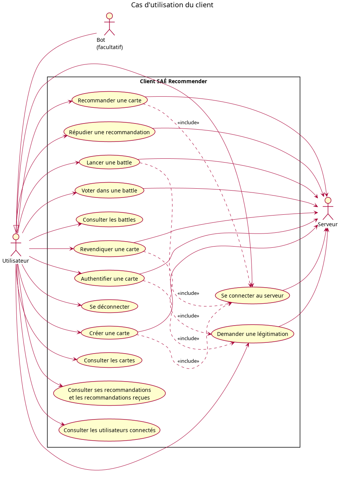

# Annexe B : Cas d'utilisation

> **Projet :** SAÉ BUT2 S3 (2026-2027), Plateforme SAÉ Recommender
> **Équipe :** Groupe 1-C

Ce diagramme montre ce que l'utilisateur peut demander au client. Chaque action est validée par le serveur, puis inscrite dans la blockchain si elle est acceptée.

## Diagramme du client

* **Acteurs :** l'utilisateur, le bot (facultatif, même droits, mais identifié par `isBot`) et le serveur.
* **Liens `include` :** créer une carte, recommander et lancer une battle demandent d'être connecté. Revendiquer et authentifier demandent d'être légitimé.
* **Hors client :** les cas du cahier des charges liés au serveur et à la blockchain (démarrage, chargement, limite de connexions, vérification de la blockchain, arrêt) sont dans les diagrammes de l'équipe serveur et blockchain / BDD.