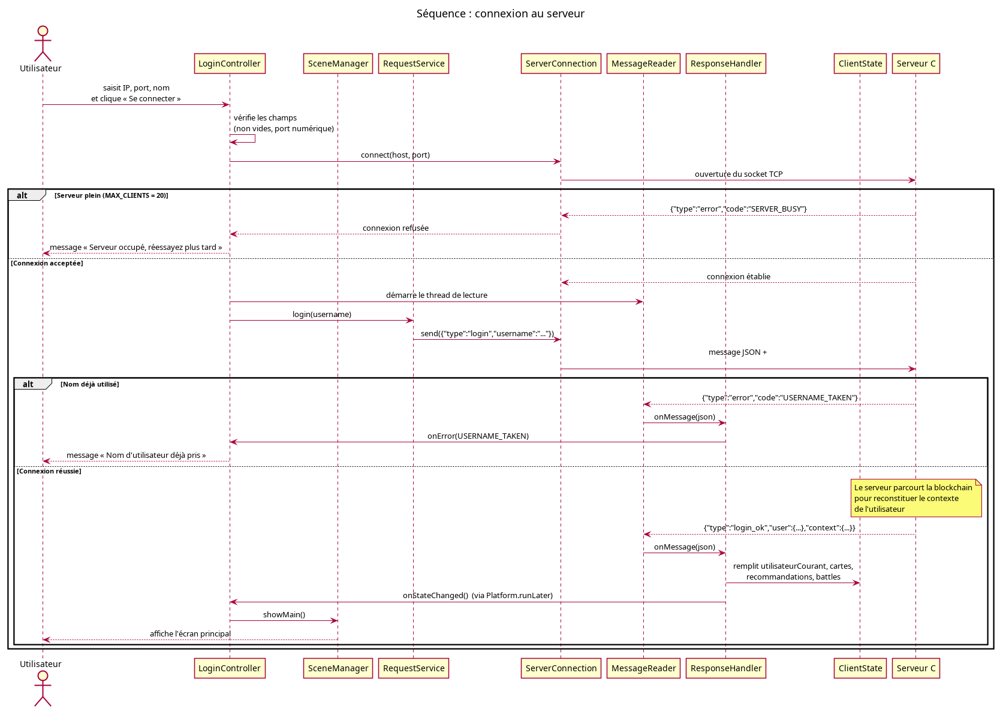
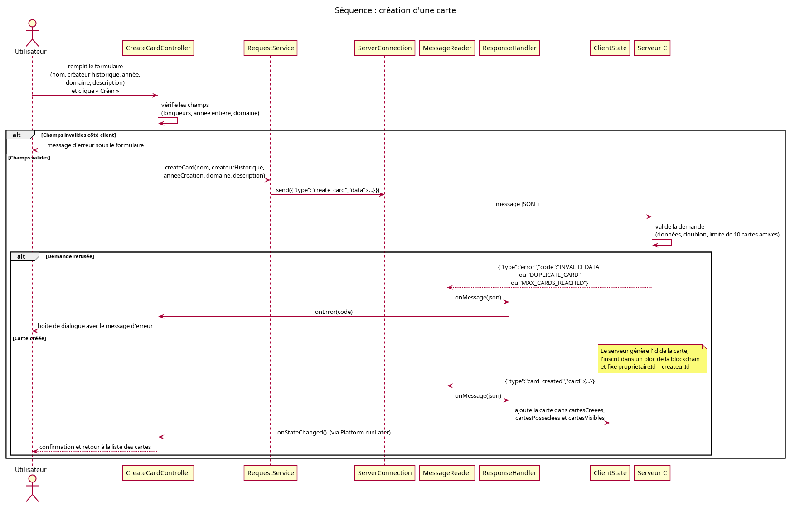
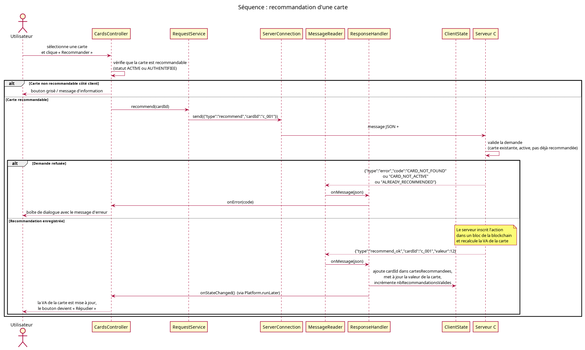
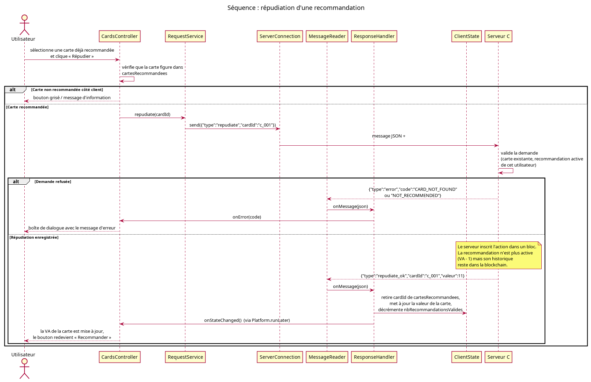
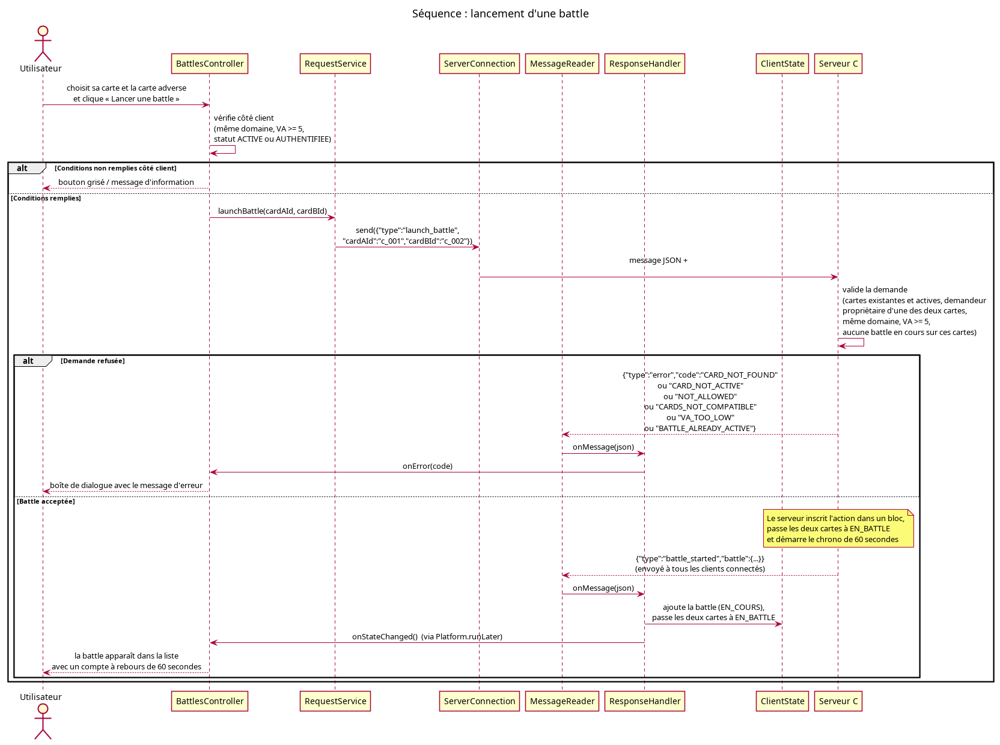
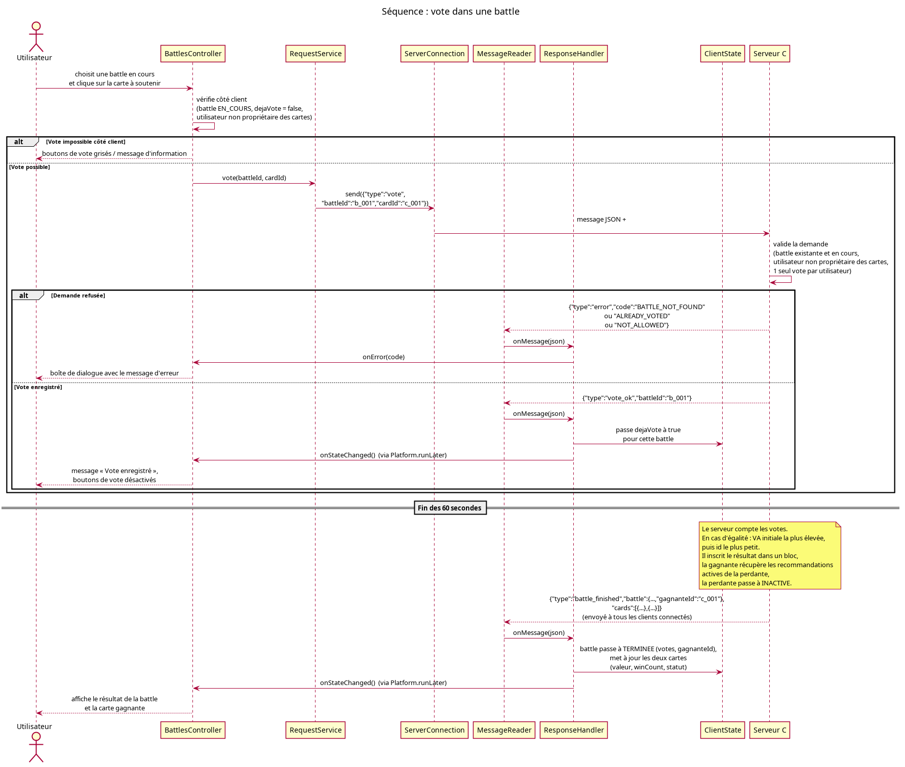
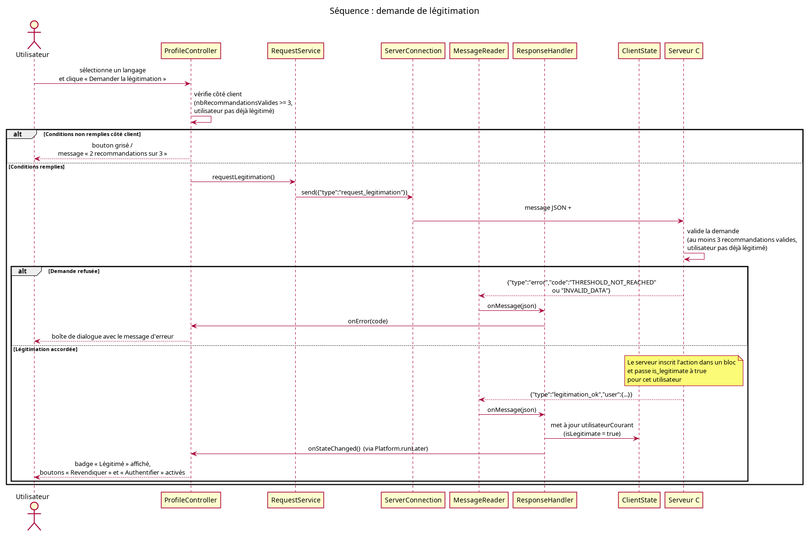
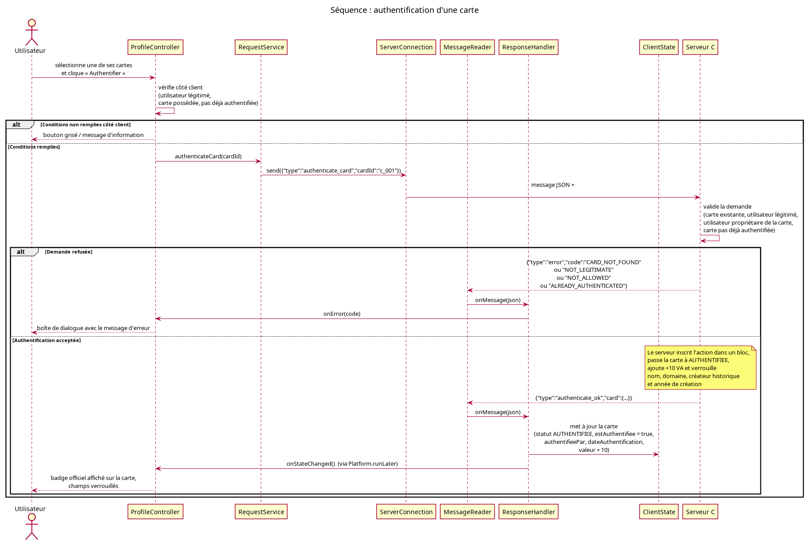
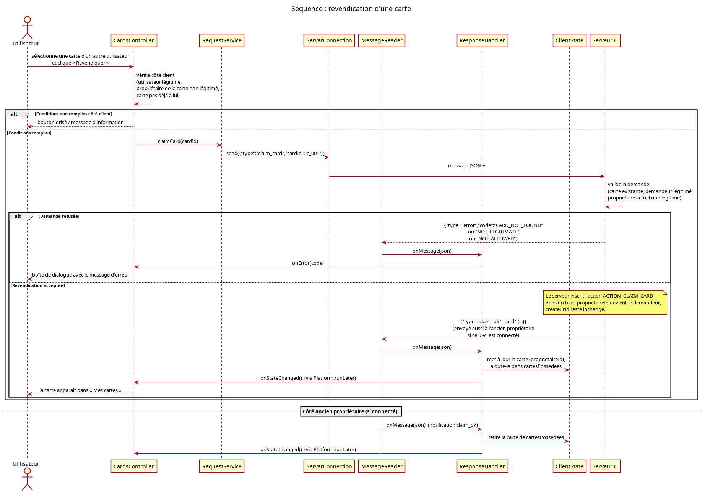
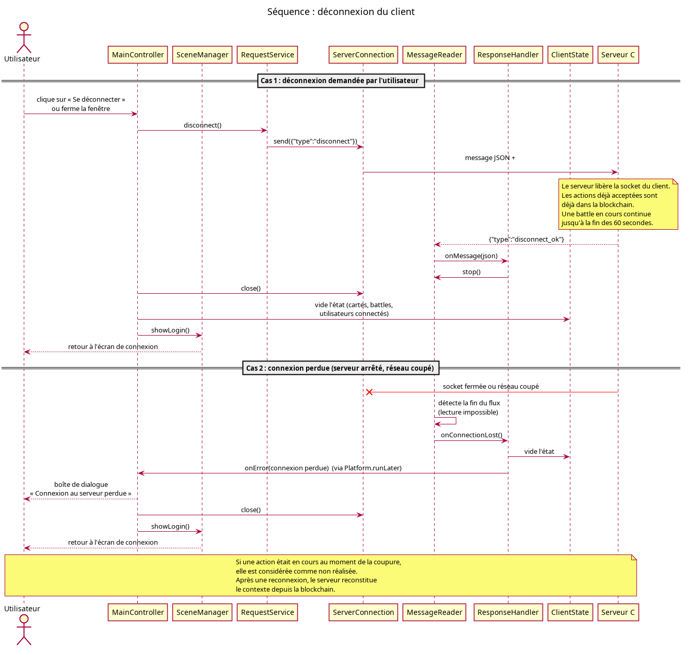

# Annexe D : Diagrammes de séquence

> **Projet :** SAÉ BUT2 S3 (2026-2027), Plateforme SAÉ Recommender
> **Équipe :** Groupe 1-C

Ces diagrammes montrent les échanges entre l'utilisateur, l'interface JavaFX, les classes du client et le serveur. Pour chaque action, le serveur valide ou refuse la demande. Seule une action validée est inscrite dans la blockchain.

## 1. Connexion

Ouverture de la socket, `login`, puis reconstitution du contexte par le serveur. Erreurs : `SERVER_BUSY`, `USERNAME_TAKEN`.

## 2. Création d'une carte

Le serveur génère l'identifiant de la carte. Erreurs : `INVALID_DATA`, `DUPLICATE_CARD`, `MAX_CARDS_REACHED`.

## 3. Recommandation

La VA de la carte augmente de 1. Erreurs : `CARD_NOT_FOUND`, `CARD_NOT_ACTIVE`, `ALREADY_RECOMMENDED`.

## 4. Répudiation

La VA diminue de 1, l'historique reste dans la blockchain. Erreurs : `CARD_NOT_FOUND`, `NOT_RECOMMENDED`.

## 5. Lancement d'une battle

Le serveur notifie tous les clients (`battle_started`) et démarre le chrono de 60 secondes. Erreurs : `CARDS_NOT_COMPATIBLE`, `VA_TOO_LOW`, `BATTLE_ALREADY_ACTIVE`, `NOT_ALLOWED`.

## 6. Vote et résultat

Un utilisateur, un vote. À la fin des 60 secondes, le serveur envoie `battle_finished` : la gagnante récupère les recommandations, la perdante devient `INACTIVE`.

## 7. Légitimation

Possible à partir de 3 recommandations valides. Erreur : `THRESHOLD_NOT_REACHED`.

## 8. Authentification

La carte passe à `AUTHENTIFIEE`, avec +10 VA et des champs verrouillés. Erreurs : `NOT_LEGITIMATE`, `ALREADY_AUTHENTICATED`.

## 9. Revendication

Transfert direct de propriété (`ACTION_CLAIM_CARD`) ; `createurId` ne change pas. Erreurs : `NOT_LEGITIMATE`, `NOT_ALLOWED`.

## 10. Déconnexion

Dé