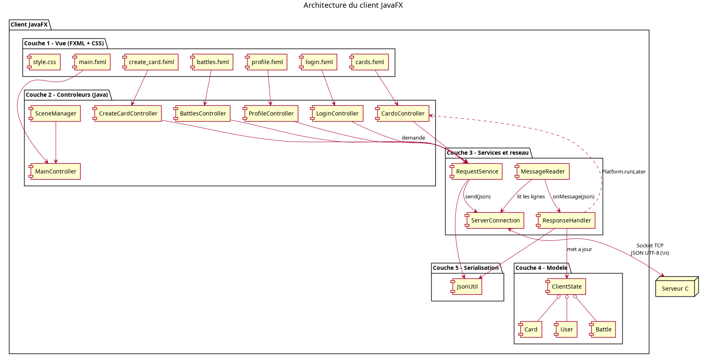
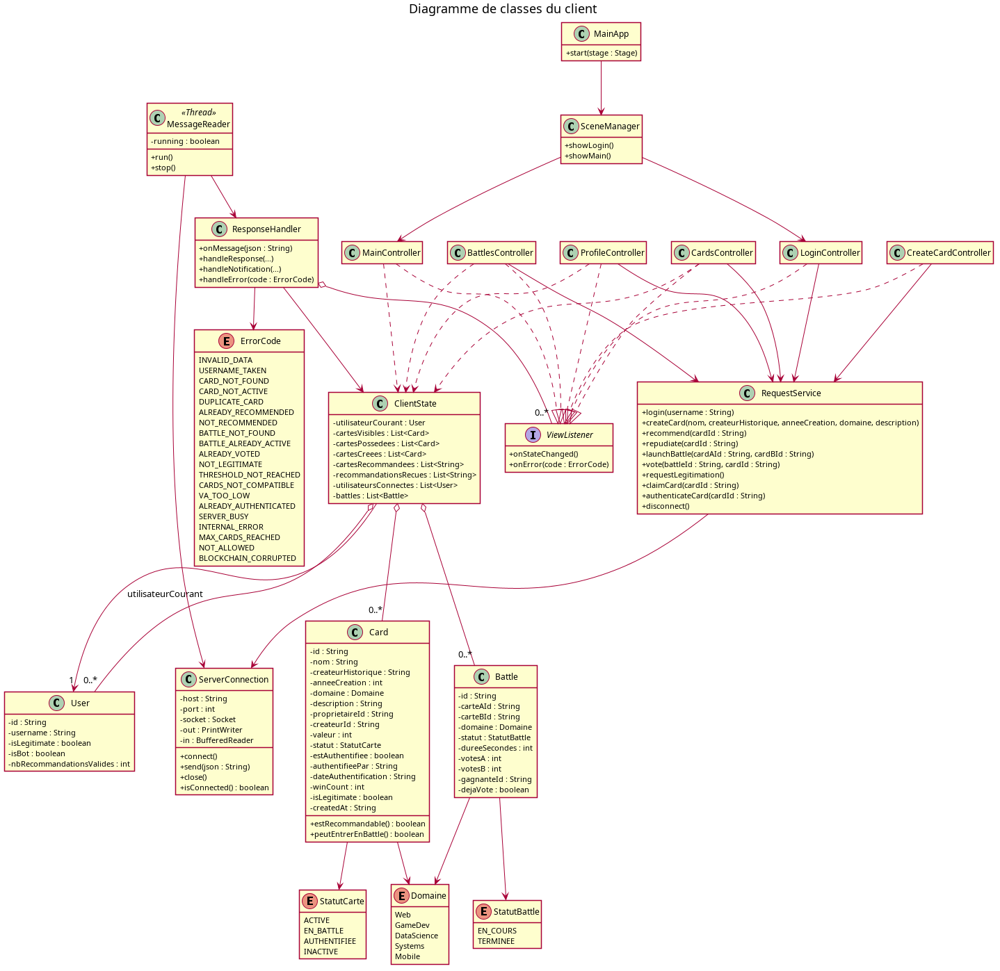
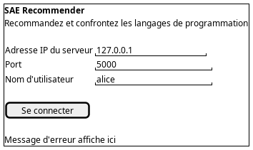
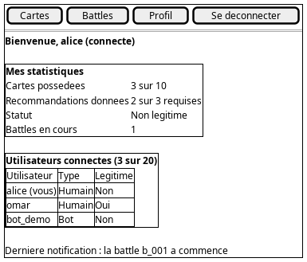
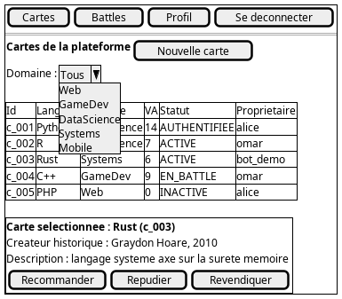
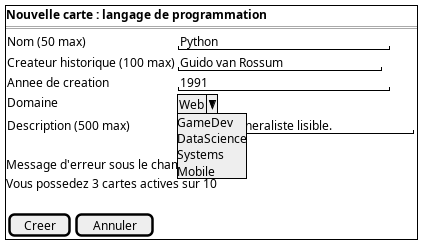
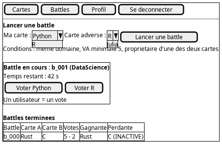
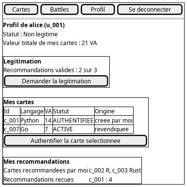

# Architecture du client

> **Projet :** SAÉ BUT2 S3 (2026-2027) — Plateforme SAÉ Recommender
> **Équipe :** Groupe 1-C
> **Partie :** Client Java / JavaFX

---

## 1. Rôle du client

Le client est l'application utilisée par l'utilisateur. Il permet de :

* se connecter au serveur (adresse IP et port) ;
* créer des cartes de langages de programmation ;
* recommander ou répudier une recommandation ;
* lancer une battle et voter ;
* demander une légitimation, revendiquer et authentifier une carte ;
* consulter ses cartes, ses recommandations, les utilisateurs connectés et les battles.

Le client ne contient aucune règle métier décisive. Toutes les actions sont **validées par le serveur** : le client envoie une demande, puis affiche la réponse. Le client n'accède **jamais** à la base de données, il communique uniquement par **socket TCP** avec le serveur.

---

## 2. Choix techniques

| Élément | Choix |
| :--- | :--- |
| Langage | Java |
| Interface graphique | JavaFX |
| Tests | JUnit |
| Communication | Socket TCP |
| Format des messages | JSON, UTF-8, un message par ligne (délimiteur `\n`) |
| Environnement | Linux Debian |

---

## 3. Organisation en couches

Le client est découpé en trois couches pour séparer l'affichage, la logique du client et le réseau.

| Couche | Rôle | Contenu |
| :--- | :--- | :--- |
| **Vue (JavaFX)** | Afficher les écrans et récupérer les actions de l'utilisateur | Fichiers FXML et contrôleurs |
| **Modèle / Services** | Garder les données du client et préparer les demandes | `Card`, `User`, `Battle`, `ClientState`, `RequestService` |
| **Réseau** | Envoyer et recevoir les messages JSON | `ServerConnection`, `MessageReader` |

Principe : la vue ne parle jamais directement au socket. Elle passe par `RequestService`, qui utilise `ServerConnection`.

---

## 4. Les classes principales

Le détail des classes (attributs et méthodes) est dans `donnees-client.md` et dans le diagramme de classes :

### 4.1 Application

* `MainApp` : point d'entrée JavaFX. Elle démarre l'application et affiche l'écran de connexion.
* `SceneManager` : gère le changement d'écran (login, principal, etc.).

### 4.2 Contrôleurs (vue)

| Contrôleur | Écran associé |
| :--- | :--- |
| `LoginController` | Connexion (IP, port, nom d'utilisateur) |
| `MainController` | Écran principal avec le menu de navigation |
| `CardsController` | Liste des cartes, recommandation, répudiation |
| `CreateCardController` | Formulaire de création d'une carte |
| `BattlesController` | Battles en cours ou terminées, vote |
| `ProfileController` | Cartes de l'utilisateur, légitimation, revendication, authentification |

### 4.3 Modèle et services

* `Card`, `User`, `Battle` : objets qui représentent les données reçues du serveur.
* `ClientState` : stocke l'état courant du client (utilisateur connecté, ses cartes, les battles, les utilisateurs connectés).
* `RequestService` : construit les demandes (créer une carte, recommander, voter, etc.) et les envoie.
* `ResponseHandler` : lit les réponses et notifications du serveur, met à jour `ClientState` et prévient la vue.

### 4.4 Réseau

* `ServerConnection` : ouvre et ferme le socket, envoie les messages.
* `MessageReader` : thread qui lit en continu les messages envoyés par le serveur.

---

## 5. Gestion des threads

Un client JavaFX utilise deux types de threads :

* **Thread JavaFX** : il gère l'affichage. Il ne doit jamais être bloqué.
* **Thread de lecture réseau** : il attend les messages du serveur (`MessageReader`).

Pourquoi un thread de lecture ? Le serveur peut envoyer un message à tout moment (début d'une battle, résultat d'un vote, nouvel utilisateur connecté). Si on attendait la réponse dans le thread JavaFX, la fenêtre se figerait.

Quand un message arrive, le thread de lecture le transmet à `ResponseHandler`, qui met à jour l'écran avec `Platform.runLater(...)`, car seul le thread JavaFX peut modifier l'interface.

---

## 6. Messages reconnus par le client

Le client distingue deux sortes de messages venant du serveur :

1. **Les réponses** à une demande du client (succès ou erreur avec un des 20 codes d'erreur).
2. **Les notifications** envoyées par le serveur sans demande (par exemple : une battle commence, une battle est terminée, la liste des utilisateurs change).

Le format exact des messages est défini dans `protocole-applicatif-commun.md`. Quand le serveur renvoie une erreur (`CARD_NOT_FOUND`, `VA_TOO_LOW`, `ALREADY_VOTED`, etc.), le client affiche un message compréhensible à l'utilisateur dans une boîte de dialogue.

---

## 7. Navigation entre les écrans

L'application contient six écrans. L'utilisateur arrive d'abord sur l'écran de connexion, puis navigue dans l'écran principal avec un menu.

Les maquettes des écrans :

| Écran | Maquette |
| :--- | :--- |
| Connexion |  |
| Principal |  |
| Cartes |  |
| Création de carte |  |
| Battles |  |
| Profil |  |

---

## 8. Déroulement d'une action

Exemple avec la recommandation d'une carte :

1. L'utilisateur clique sur « Recommander » dans l'écran des cartes.
2. `CardsController` appelle `RequestService`.
3. `RequestService` construit le message JSON et l'envoie via `ServerConnection`.
4. Le serveur valide ou refuse l'action.
5. `MessageReader` reçoit la réponse et la transmet à `ResponseHandler`.
6. `ResponseHandler` met à jour `ClientState`, puis l'écran est rafraîchi.

Les autres actions (création, répudiation, battle, vote, légitimation, revendication, authentification, déconnexion) suivent le même schéma. Elles sont détaillées dans les diagrammes de séquence (voir `annexe-d-sequences.md`).

---

## 9. Déconnexion et erreurs réseau

* Si l'utilisateur ferme l'application, le client envoie une demande de déconnexion, puis ferme le socket.
* Si la connexion est perdue (serveur arrêté, réseau coupé), `MessageReader` le détecte, le client affiche un message et revient à l'écran de connexion.
* Si le serveur est plein (`MAX_CLIENTS = 20`), il répond `SERVER_BUSY` et le client affiche un message d'attente.
* Une action en cours au moment de la coupure est considérée comme non réalisée.

---

## 10. Client automatique (bot)

Un client automatique n'est pas obligatoire. S'il est réalisé, il réutilisera les couches **Modèle** et **Réseau** sans interface graphique. Il devra s'identifier comme « bot » auprès du serveur pour que ses actions soient distinguées de celles des utilisateurs humains. Cette partie sera décidée plus tard.

---

## 11. Tests prévus

Les tests du client seront écrits avec JUnit. Ils porteront surtout sur :

* la construction et la lecture des messages JSON ;
* la mise à jour de `ClientState` à partir d'une réponse du serveur ;
* le traitement des codes d'erreur.

---

## 12. Fichiers liés

* `donnees-client.md` : classes et attributs détaillés
* `protocole-applicatif-commun.md` : format des messages
* `annexe-c-classes.md` et `annexe-d-sequences.md` : diagrammes
